# 100 Days of Code

Documenting my progress through the #100DaysOfCode challenge.

---

## 📌 Table of Contents

- [Day 1: Multiplication Table](#-day-1-multiplication-table)
- [Day 2: Odd/Even Sorter](#-day-2-oddeven-sorter)
- [Day 3: Number Guessing Game](#-day-3-number-guessing-game)
- [Day 4: Rock Paper Scissors](#-day-4-rock-paper-scissors)
- [Day 5: Binary Search Guessing Game](#-day-5-binary-search-guessing-game)
- [Day 6: Two Sum (Two Pointer)](#-day-6-two-sum-two-pointer)
- [Day 7: Bubble Sort](#-day-7-bubble-sort)
- [Day 8: Collatz Sequence](#-day-8-collatz-sequence)
- [Day 9: Word Counter](#-day-9-word-counter)
- [Day 10: Factorial Calculator (Recursion)](#-day-10-factorial-calculator-recursion)
- [Day 11: Number Statistics](#-day-11-number-statistics-min-max-sum-average)
- [Day 12: Quadratic Equation Solver](#-day-12-quadratic-equation-solver)
- [Day 13: Card Class & Driver Program](#-day-13-card-class--driver-program-java)
- [Day 14: TicTacToe Game](#-day-14-tictactoe-game-java)

---

## ✅ Day 1: Multiplication Table Generator

A command-line Python script that:
- Asks for a number `N`
- Prints an `N x N` multiplication table
- Uses nested loops and formatted string output

### 📂 Script File
[day1_multiplication_table.py](day01-09/day1_multiplication_table.py)

### Example Output for N = 12
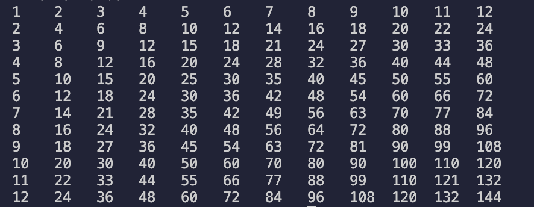

---

## ✅ Day 2: Odd/Even Number Sorter

A Python script that:
- Asks how many numbers the user wants to enter
- Validates input to make sure all numbers are greater than 0
- Separates even and odd numbers
- Displays counts and clean formatted output

### Example Features:
- Uses `for` loops and `if-else` conditionals
- Stores values in two separate lists
- Outputs formatted summary at the end

### 📂 Script File
[day2_odd_even_sorter.py](day01-09/day2_odd_even_sorter.py)

### Example Output

---

## ✅ Day 3: Number Guessing Game

A Python game where the player guesses a random number between 1 and 100, with three difficulty modes and hints.

### Example Features:
- Three difficulty modes:
  - Easy: 20 tries
  - Medium: 10 tries
  - Hard: 5 tries
- Validates that guesses are between 1 and 100
- Gives a hint (even/odd) after 3 total attempts
- Tracks number of attempts and ends the game if tries run out
- Displays win or loss messages

### 📂 Script File
[day3_number_guessing_game.py](day01-09/day3_number_guessing_game.py)

### Example Output
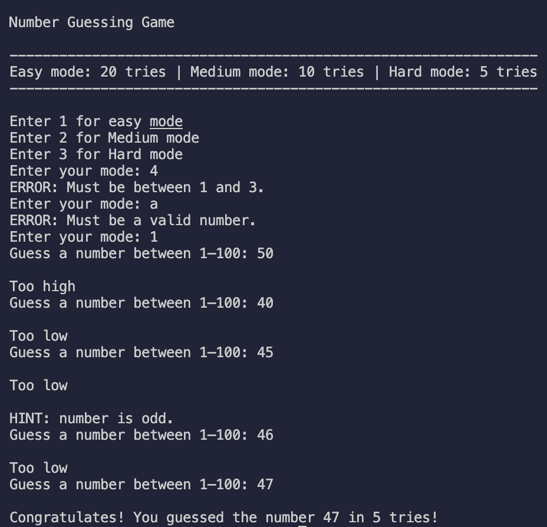

---

## ✅ Day 4: Rock, Paper, Scissors Game

A command-line Rock, Paper, Scissors game with a running scoreboard that tracks results across multiple sessions during one run.

### Example Features:
-Menu system:
  -Play a round
  -View scoreboard
  -Quit the game

-Input validation for both menu choices and game rounds
-Accepts shorthand (r, p, s) and full-word inputs (rock, paper, scissors)
-Random CPU choice from a set of valid options
-Emoji-based display for player and CPU picks
-Running scoreboard that tracks total wins, losses, and ties
-Allows multiple rounds in a single game session

### 📂 Script File
[day4_rock_paper_scissors_game.py](day01-09/day4_rock_paper_scissors_game.py)

### Example Output

---

## ✅ Day 5: Binary Search Guessing Game

A Python console game where the computer guesses a number the player is thinking of between 1 and 100 using the binary search algorithm.

### Example Features:
- Uses binary search to efficiently guess the number in ≤ 7 tries
- Asks the player for feedback after each guess:
  - **h** → higher
  - **l** → lower
  - **c** → correct
- Validates feedback input (keeps asking until valid)
- Detects and handles inconsistent feedback

### 📂 Script File
[day5_binary_search_guessing_game.py](day01-09/day5_binary_search_guessing_game.py)

### Example Output
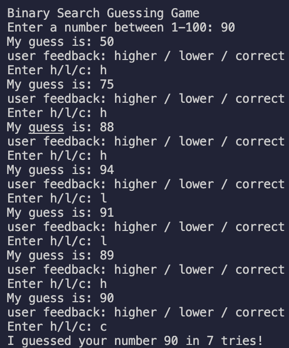

---

## ✅ Day 6: Two Sum (Two-Pointer)

Finds a pair of numbers in a sorted list that add up to a target using the two-pointer technique

### Example Features:
- Starts with left and right pointers and moves inward
- O(n) time once the list is sorted
- Prints the first matching pair
- Handles the “no pair” case cleanly

### 📂 Script File
[day6_two_sum_two_pointer.py](day01-09/day6_two_sum_two_pointer.py)

### Example Output
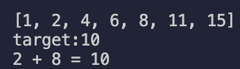

---

## ✅ Day 7: Bubble Sort Implementation

A Python script that implements the Bubble Sort algorithm to sort a list of numbers in ascending order.

### Example Features:
- Uses a while loop that repeats until no swaps are needed
- Swaps adjacent elements if they’re out of order
- Automatically stops once the list is fully sorted
- Demonstrates the logic behind one of the simplest sorting algorithms

### 📂 Script File
[day7_bubble_sort.py](day01-09/day7_bubble_sort.py)

### Example Output
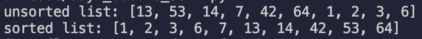

---

## ✅ Day 8: Collatz Sequence Explorer

A Python script that generates the Collatz sequence (also known as the 3n + 1 problem) for a user-entered positive integer.

The sequence repeatedly applies the rules:
- If the number is even → divide it by 2
- If the number is odd → multiply by 3 and add 1
- It continues until the sequence reaches 1.

## Example Features:
- Validates user input to ensure a positive integer
- Builds and displays the full sequence from the starting number to 1
- Counts and outputs the total number of steps taken
- Demonstrates a famous unsolved problem in mathematics in a simple program

### 📂 Script File
[day8_collatz_sequence.py](day01-09/day8_collatz_sequence.py)

### Example Output
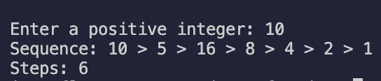

---

## ✅ Day 9: Word Counter

A Python script that analyzes a user-entered sentence or paragraph and counts how many times each word appears. The program removes punctuation, converts all words to lowercase, and then builds a dictionary mapping each unique word to the number of times it occurs.

## Example Features:
- Removes punctuation so `"dog,"` and `"dog"` are treated the same
- Converts text to lowercase to avoid duplicates like `"The"` vs `"the"`
- Splits the text into individual words
- Builds a dictionary where keys = words and values = counts
- Displays the dictionary of word frequencies

### 📂 Script File
[day9_word_counter.py](day01-09/day9_word_counter.py)

### Example Output
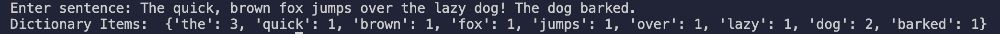

---

## ✅ Day 10: Factorial Calculator (Recursion)

A Python script that calculates the factorial of a user-entered non-negative integer using recursion. The program validates input to ensure only whole numbers ≥ 0 are accepted. Once valid input is given, the script computes the factorial based on the formula:

\[
n! = n \times (n-1)! \quad \text{with } 0! = 1
\]

## Example Features:
- Validates input: only non-negative integers are allowed
- Rejects invalid input like negative numbers or strings
- Uses a recursive function for factorial calculation
- Displays the factorial result in a clean format

### 📂 Script File
[day10_factorial.py](day10-19/_factorial.py)

### Example Output
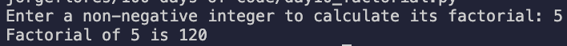

---

## ✅ Day 11: Number Statistics (Min, Max, Sum, Average)

A Java program that asks the user to enter a list of numbers and then calculates key statistics:  
- The **biggest number**  
- The **smallest number**  
- The **sum** of all numbers  
- The **average** of the numbers  

The program validates the number of inputs (must be greater than 0), stores the values in an array, and uses a loop to compute the results.

## Example Features:
- Validates input: array size must be positive  
- Stores numbers in an array for processing  
- Finds the maximum and minimum values  
- Calculates the sum and average of all numbers  
- Displays the results in a clear format  

### 📂 Script File
[day11_numberStatistics.java](day10-19/day11_numberStatistics.java)

### Example Output
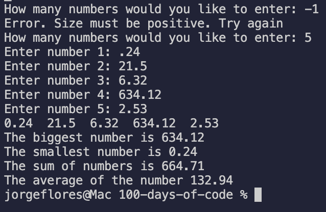

---

## ✅ Day 12: Quadratic Equation Solver

A Python program that solves quadratic equations of the form: 
- Asks the user to enter coefficients **a, b, c**  
- Calculates the **discriminant**  
- Applies the **quadratic formula** to find the roots  
- Handles both **real** and **complex** solutions  
- Outputs results in **simplified form** (fractions for real numbers, i for imaginary)  

## Example Features:
- Validates input: checks if `a = 0` (not quadratic)  
- Uses fractions for clean, simplified real roots  
- Replaces Python’s `j` with math-style `i` for complex roots  
- Ensures results are always shown in **order** (`x1 < x2`)  
- Clean and math-friendly output  

### 📂 Script File
[day12_quadraticSolver.py](day10-19/day12_quadraticSolver.py)

### Example Output
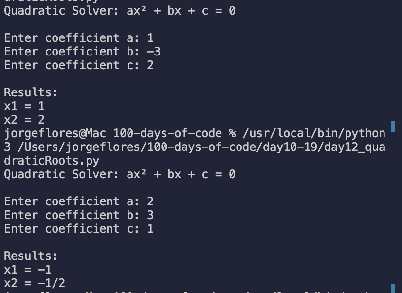

---

## ✅ Day 13: Card Class & Driver Program (Java)

A Java project with two files:  
- **Card.java** → Defines a playing card with rank and suit  
- **Main.java** → Driver program to create and compare cards  

## Example Features:
- Encapsulates attributes rank and suit
- Provides a toString() method to display cards in readable form  
- Implements a compareTo() method to compare cards by suit and rank  
- Demonstrates object creation and method usage in the driver program  

### 📂 Project Files
[Card.java](day10-19/day13_class_driver/Card.java)  
[Main.java](day10-19/day13_class_driver/Main.java)  

### Example Output
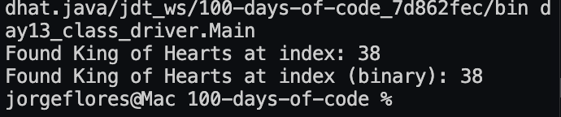

---

## ✅ Day 14: TicTacToe Game (Java)

A Java console-based TicTacToe game with user vs. computer.  
The game is played on a **3×3 grid** (represented internally as a 5×5 char array with separators).  

## Example Features:
- User plays as X, computer plays as*O
- Input validation: only accepts numbers 1–9 for moves  
- Computer generates random moves with varied messages  
- Checks for win conditions across rows, columns, and diagonals  
- Detects draw when the board is full  
- Displays a clear index guide before the game starts  

### 📂 Project Files
[TicTacToe.java](day10-19/day14_TicTacToe/TicTacToe.java)  

### Example Output
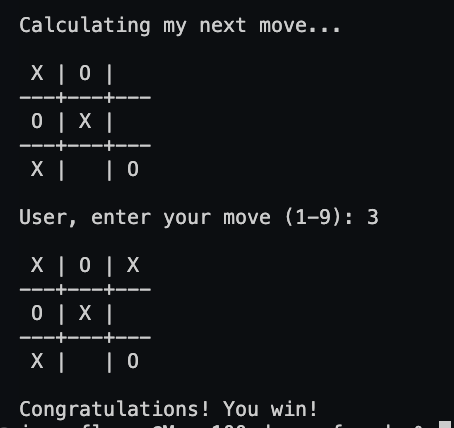
