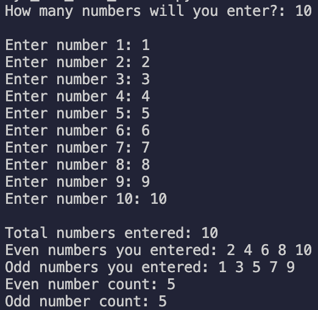
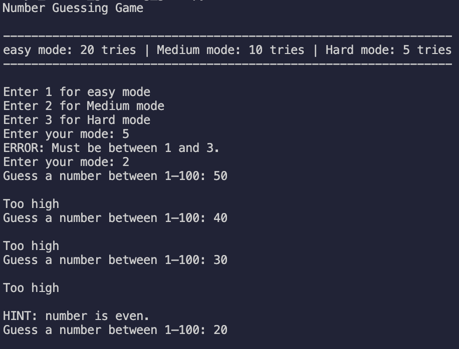
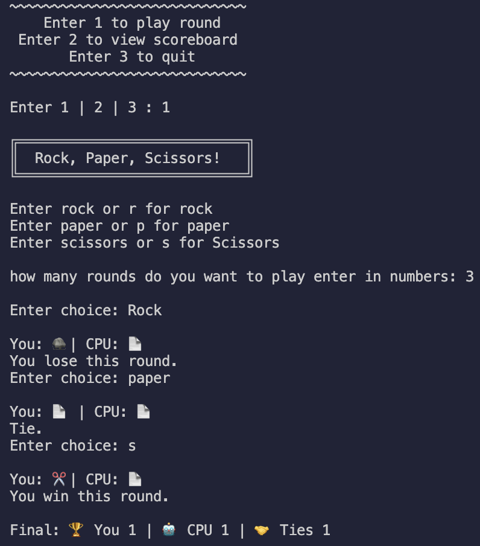
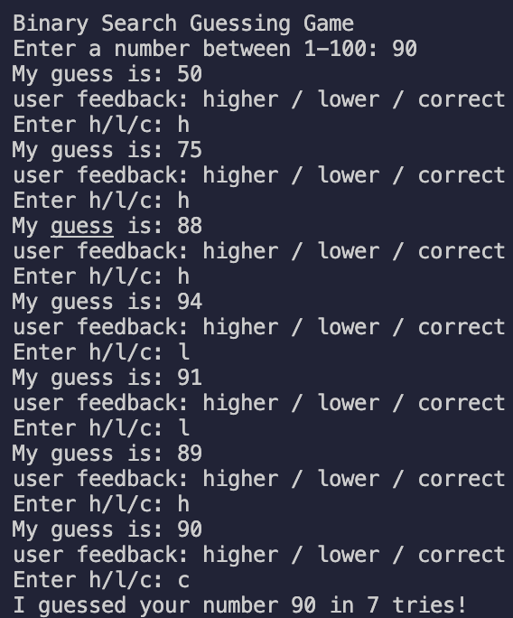
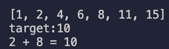

# 100 Days of Code – Python

Documenting my progress through the #100DaysOfCode challenge.

---

## ✅ Day 1: Multiplication Table Generator

A command-line Python script that:
- Asks for a number `N`
- Prints an `N x N` multiplication table
- Uses nested loops and formatted string output

### 📂 Script File
[day1_multiplication_table.py](day1_multiplication_table.py)

### Example Output for N = 12

---

## ✅ Day 2: Odd/Even Number Sorter

A Python script that:
- Asks how many numbers the user wants to enter
- Validates input to make sure all numbers are greater than 0
- Separates even and odd numbers
- Displays counts and clean formatted output

### Example Features:
- Uses `for` loops and `if-else` conditionals
- Stores values in two separate lists
- Outputs formatted summary at the end

### 📂 Script File
[day2_odd_even_sorter.py](day2_odd_even_sorter.py)

### Example Output

---

## ✅ Day 3: Number Guessing Game

A Python game where the player guesses a random number between 1 and 100, with three difficulty modes and hints.

### Example Features:
- Three difficulty modes:
  - Easy: 20 tries
  - Medium: 10 tries
  - Hard: 5 tries
- Validates that guesses are between 1 and 100
- Gives a hint (even/odd) after 3 total attempts
- Tracks number of attempts and ends the game if tries run out
- Displays win or loss messages

### 📂 Script File
[day3_number_guessing_game.py](day3_number_guessing_game.py)

### Example Output

---

## ✅ Day 4: Rock, Paper, Scissors Game

A command-line Rock, Paper, Scissors game with a running scoreboard that tracks results across multiple sessions during one run.

### Example Features:
-Menu system:
  -Play a round
  -View scoreboard
  -Quit the game

-Input validation for both menu choices and game rounds
-Accepts shorthand (r, p, s) and full-word inputs (rock, paper, scissors)
-Random CPU choice from a set of valid options
-Emoji-based display for player and CPU picks
-Running scoreboard that tracks total wins, losses, and ties
-Allows multiple rounds in a single game session

### 📂 Script File
[day4_rock_paper_scissors_game.py](day4_rock_paper_scissors_game.py)

### Example Output

---

## ✅ Day 5: Binary Search Guessing Game

A Python console game where the computer guesses a number the player is thinking of between 1 and 100 using the binary search algorithm.

### Example Features:
- Uses binary search to efficiently guess the number in ≤ 7 tries
- Asks the player for feedback after each guess:
  - **h** → higher
  - **l** → lower
  - **c** → correct
- Validates feedback input (keeps asking until valid)
- Detects and handles inconsistent feedback

### 📂 Script File
[day5_binary_search_guessing_game.py](day5_binary_search_guessing_game.py)

### Example Output

---

## ✅ Day 6: Two Sum (Two-Pointer)

Finds a pair of numbers in a sorted list that add up to a target using the two-pointer technique

### Example Features:
- Starts with left and right pointers and moves inward
- O(n) time once the list is sorted
- Prints the first matching pair
- Handles the “no pair” case cleanly

### 📂 Script File
[day6_two_sum_two_pointer.py](day6_two_sum_two_pointer.py)

### Example Output
