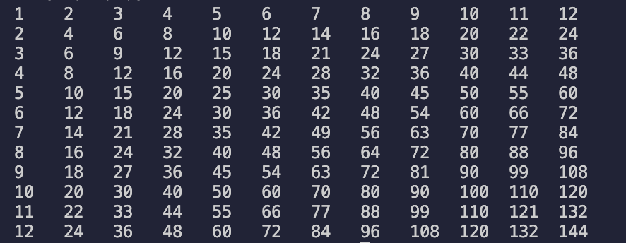
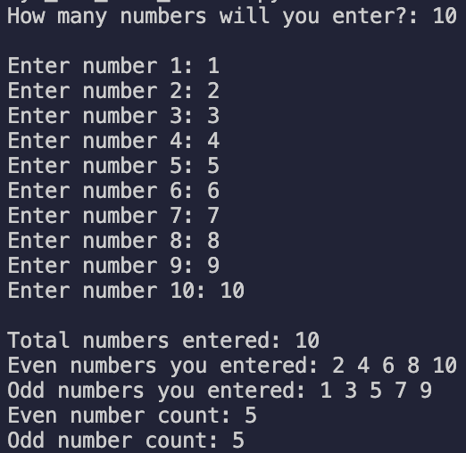

# 100 Days of Code – Python

Documenting my progress through the #100DaysOfCode challenge.

---

## ✅ Day 1: Multiplication Table Generator

A command-line Python script that:
- Asks for a number `N`
- Prints an `N x N` multiplication table
- Uses nested loops and formatted string output

### 📂 Script File
[day1_multiplication_table.py](day1_multiplication_table.py)

### Example Output for N = 12

---

## ✅ Day 2: Odd/Even Number Sorter

A Python script that:
- Asks how many numbers the user wants to enter
- Validates input to make sure all numbers are greater than 0
- Separates even and odd numbers
- Displays counts and clean formatted output

### Example Features:
- Uses `for` loops and `if-else` conditionals
- Stores values in two separate lists
- Outputs formatted summary at the end

### 📂 Script File
[day2_odd_even_sorter.py](day2_odd_even_sorter.py)

### Example Output

---